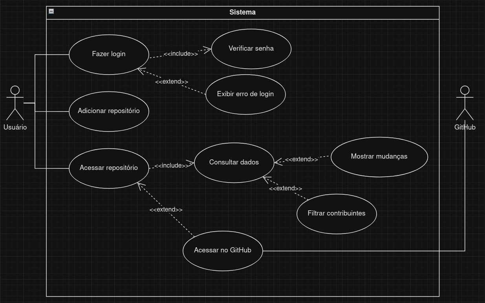

# Especificações do Projeto

Este projeto visa simplificar a gestão de projetos acadêmicos no ambiente do GitHub, aliviando a carga de trabalho dos professores na avaliação das contribuições dos alunos. Ao automatizar a sincronização de informações, gerar relatórios detalhados e oferecer uma interface intuitiva, busca-se aumentar a eficiência e promover um acompanhamento mais preciso e ágil das atividades dos estudantes, incentivando o aprendizado colaborativo e aprimorando a experiência educacional.

## Personas

João Campos tem 35 anos, é professor formado em Ciência da Computação e leciona nos cursos de tecnologia. Ele utiliza o GitHub em suas aulas, assim consegue ver todas as mudanças realizadas pelos alunos, porém, mesmo fazendo uma divisão em grupos, João precisa de muito tempo para avaliar as mudanças, pois são múltiplas turmas com múltiplos grupos.

Maria Silva tem 40 anos e é professora universitária de Engenharia de Software. Ela ensina disciplinas avançadas de desenvolvimento de software e gerenciamento de projetos. Maria utiliza o GitHub em suas aulas para supervisionar o progresso dos projetos dos alunos. No entanto, ela enfrenta dificuldades para acompanhar todas as contribuições devido ao grande volume de projetos e equipes.

Pedro Oliveira é um professor de 30 anos, formado em Engenharia Elétrica, que ministra disciplinas relacionadas a sistemas embarcados e programação de baixo nível. Ele usa o GitHub como plataforma principal para colaboração e avaliação de projetos práticos de seus alunos. Pedro enfrenta desafios semelhantes aos de João e Maria, pois precisa de uma maneira mais eficiente de avaliar as contribuições dos alunos em vários projetos.

## Histórias de Usuários

Com base na análise das personas forma identificadas as seguintes histórias de usuários:

| EU COMO...`PERSONA` | QUERO/PRECISO ...`FUNCIONALIDADE` | PARA ...`MOTIVO`|
|------------|-------------------|----------|
| João Campos  | avaliar os projetos de forma mais objetiva | aumentar minha produtividade |
| Maria Silva  | ter uma visão consolidada das contribuições dos alunos em projetos do GitHub	| facilitar a avaliação e o acompanhamento do progresso dos alunos em suas disciplinas
| Pedro Oliveira  | visualizar as alterações nos projetos dos alunos de forma mais eficiente	| gerenciar melhor o tempo dedicado à avaliação e feedback dos alunos

## Requisitos

As tabelas que se seguem apresentam os requisitos funcionais e não funcionais que detalham o escopo do projeto.

### Requisitos Funcionais

|ID    | Descrição do Requisito  | Prioridade |
|------|-----------------------------------------|----|
|RF-001| Gerenciar cadastros de usuario |ALTA|
|RF-002| Gerenciar repositorios |ALTA|
|RF-003| Mostrar contribuintes do repositorio |ALTA
|RF-004| Gerenciar metricas do repositorio |Alta|
|RF-005| Filtrar metricas do repositorio por contribuinte e data |Alta|
|RF-007| Buscar Commits |Alta|
|RF-008| Redirecionar o usuario para o respectivo commit |Alta|
|RF-009| Filtrar repositorios |Médio|
|RF-010| Criar metricas por arquivos |Médio|
|RF-011| Gerar insights a partir de metricas do repositorio |Baixo|

### Requisitos não Funcionais

|ID     | Descrição do Requisito  |Prioridade |
|-------|-------------------------|----|
| RNF-001 | A aplicação deve ser publicada em um ambiente acessível público na Internet. | ALTA |
| RNF-002 | A aplicação deverá ser responsiva permitindo a visualização em dispositivos diversos de forma adequada. | ALTA |
| RNF-003 | A aplicação deve ser compatível com os navegadores do mercado: Google Chrome, Firefox e Microsoft Edge. | ALTA |
| RNF-004 | A aplicação deve ser intuitiva e dinâmica. | ALTA |
| RNF-005 | Assegurar a privacidade dos usuários conforme a LGPD. | ALTA |

> **Prioridade: Alta / Média / Baixa. 

## Restrições

O projeto está restrito pelos itens apresentados na tabela a seguir.

|ID| Restrição                                             |
|--|-------------------------------------------------------|
|01| O projeto deverá ser entregue até o final do semestre |
|02| A equipe de desenvolvimento deve contar com 6 (seis) desenvolvedores |
|03| Deve haver pelo menos 1 (uma) reunião geral por semana, com duração de até 2 (duas) horas |

## Diagrama de Casos de Uso

