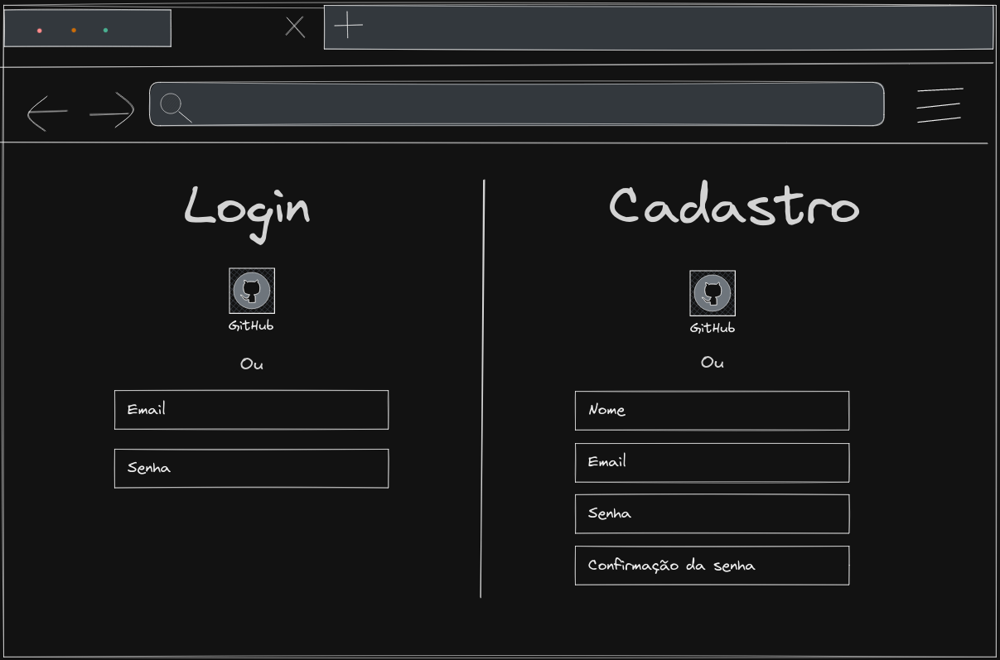
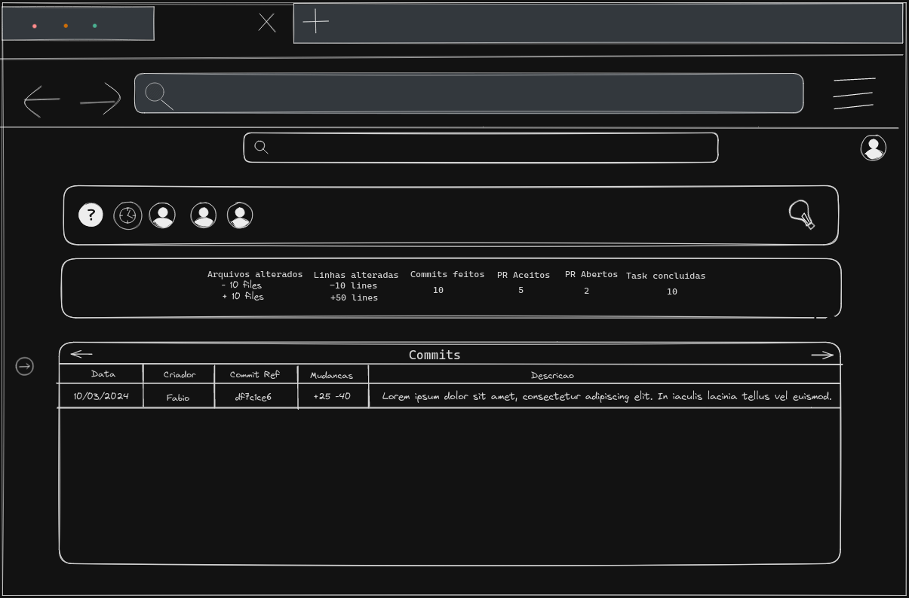

# Projeto de Interface
Visão geral da interação do usuário pelas telas do sistema e protótipo interativo das telas com as funcionalidades que fazem parte do sistema (wireframes).

## Diagrama de Fluxo
> **Fluxo de Cadastro**:
> 
>
> **Fluxo de Login**:
> 
>
> **Fluxo Logout**:
> 
>
> **Fluxo Troca de senha**:
> 
>
> **Fluxo Inserir Repositório**:
> 
>
> **Fluxo Pagina do Repositório**:
> 
>
> **Fluxo Remover um Repositório**:
> 
>
> **Fluxo Tornar um Repositório favorito**:
> 
>
> **Fluxo Filtrar repositórios favoritos**:
> 
>
> **Fluxo Acesse um Commit**:
> 

## Wireframes

|Imagem|Descrição|
|------|---------|
|  | Tela de login ou cadastro do usuário. |
|  | Tela principal, da qual o usuário poderá cadastrar, pesquisar e acessar seus repositórios. |
|  | Tela dos dados do repositório. Versão de commits. |
