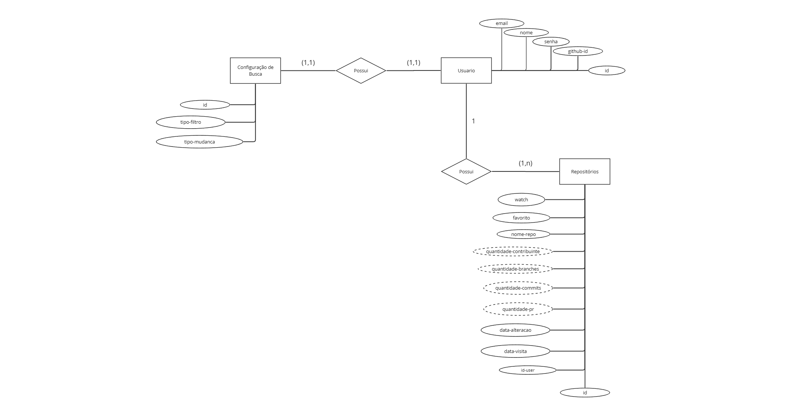

# Arquitetura da Solução

Pré-requisitos: <a href="3-Projeto de Interface.md"> Projeto de Interface</a>

Definição de como o software é estruturado em termos dos componentes que fazem parte da solução e do ambiente de hospedagem da aplicação.

## Diagrama de Classes

O diagrama de classes ilustra graficamente como será a estrutura do software, e como cada uma das classes da sua estrutura estarão interligadas. Essas classes servem de modelo para materializar os objetos que executarão na memória.

 

## Modelo ER (Projeto Conceitual)

O modelo ER para o projeto RepoInsight consiste em três entidades principais: Usuários, Repositórios e Configuração de Busca.

Usuários: Representa as pessoas que utilizam o sistema. Pode incluir atributos como nome, email, senha, github-id e id.

Repositórios: Refere-se aos modelos quantitativos do repositorio. Pode incluir atributos como nome-repo, favorito, quantidade-contribuinte, quantidade-branches, quantidade-commits, quantidade-pr, data-alteracao, data-visita, watch e id

Configuração de Busca: Descreve as preferências de busca de cada usuário. Pode incluir atributos como tipo=busca, tipo-filtro, tipo-mudanca e id.

Relacionamentos entre essas entidades podem incluir:

Um usuário pode estar associado a vários repositórios (um-para-muitos), indicando quais repositórios eles têm acesso.

Um usuário pode ter um tipo de configurações de busca (um-pra-um).

Este modelo fornece uma estrutura clara para representar as interações entre os usuários, os repositórios e as configurações de busca dentro do sistema RepoInsight.

## Projeto da Base de Dados

O projeto da base de dados corresponde à representação das entidades e relacionamentos identificadas no Modelo ER, no formato de tabelas, com colunas e chaves primárias/estrangeiras necessárias para representar corretamente as restrições de integridade.
 

## Tecnologias Utilizadas

Descreva aqui qual(is) tecnologias você vai usar para resolver o seu problema, ou seja, implementar a sua solução. Liste todas as tecnologias envolvidas, linguagens a serem utilizadas, serviços web, frameworks, bibliotecas, IDEs de desenvolvimento, e ferramentas.

Apresente também uma figura explicando como as tecnologias estão relacionadas ou como uma interação do usuário com o sistema vai ser conduzida, por onde ela passa até retornar uma resposta ao usuário.

## Hospedagem

Explique como a hospedagem e o lançamento da plataforma foi feita.

> **Links Úteis**:
>
> - [Website com GitHub Pages](https://pages.github.com/)
> - [Programação colaborativa com Repl.it](https://repl.it/)
> - [Getting Started with Heroku](https://devcenter.heroku.com/start)
> - [Publicando Seu Site No Heroku](http://pythonclub.com.br/publicando-seu-hello-world-no-heroku.html)
