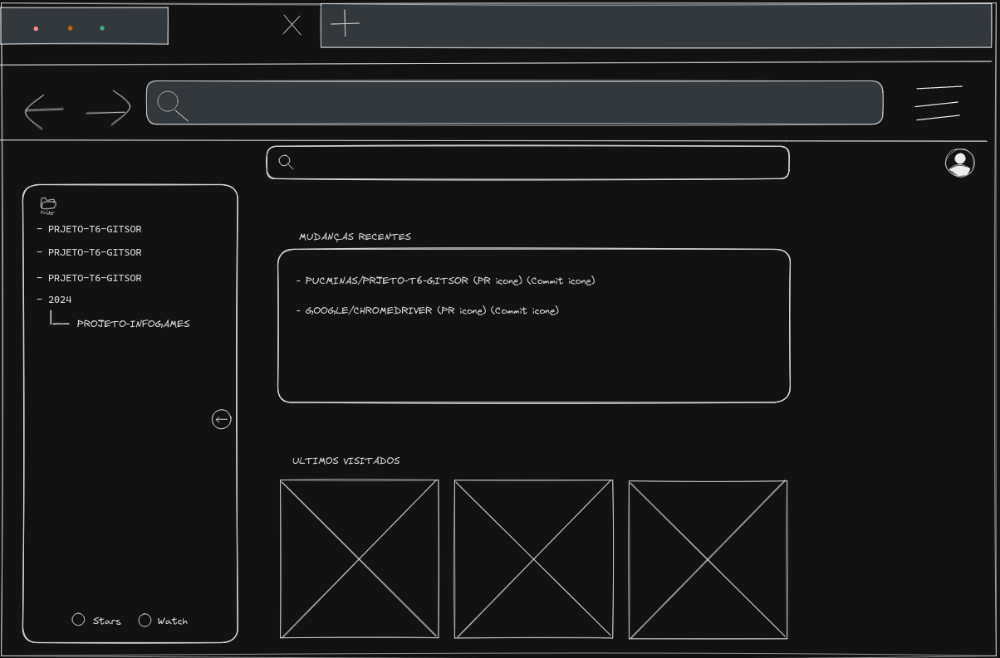

# Template Padrão da Aplicação

O template padrão será baseado no seguinte wireframe:

A partir da home page, teremos em todas as páginas a barra de pesquisa, juntamente com o icone de usuário e a coluna lateral esquerda
contendo a árvore de repositórios cadastrados pelo usuário.
